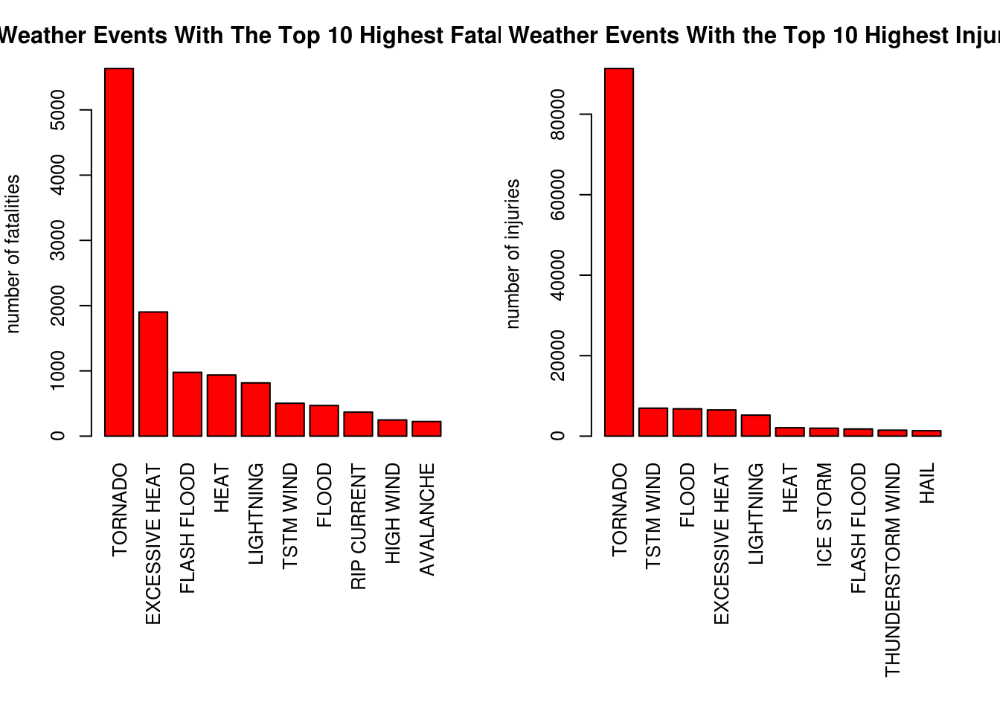

# Reproducible Research: Peer Assessment 2
Tomasz Samsel  
05/24/2015  


# Impact of Severe Weather Events on Public Health and Economy in the United States

## Synopsis.

Storm and other severe weather events can cause both public health and economic problems for communities and municipalities. Many severs events can results in fatalities, injuries and property damage. Preventing such outcomes to the extent possible is a key concern. The U.S. National Oceanic and Atmospheric Administration's (NOAA) storm database tracks characteristics of major storms and weather events in the United States, include when and where they occur, aswell as estimates of any fatalities, injuries and property damage. This report contains the exploratory analysis results on the health and economic impact by the severe weather events based on the data from NOAA database.

## Data processing.

Libraries required for data processing are: R.utils, dplyr and ggplot.

### Loading the data.


```r
# download file from URL
if (!file.exists("storm.csv.bz2")) {
        file <- "http://d396qusza40orc.cloudfront.net/repdata%2Fdata%2FStormData.csv.bz2"
        destfile <- "storm.csv.bz2"
        download.file(file, destfile)
}

# unzip file
if (!file.exists("storm.csv")) {
    library(R.utils)
    bunzip2("storm.csv.bz2", "storm.csv", remove = FALSE)
}

# load data into R

data <- read.csv("storm.csv")
```

### Reshaping the data.

Now, for further analysis we need to change factor walues of PROPDMGEXP and CROPDMGEXP to numeric values of damage coused by events. Group data by events occured, and do summary on the groups to have a clean data for plotting.


```r
## Updating the property exponent data

data$PROPEXP[data$PROPDMGEXP == "K"] <- 1000
data$PROPEXP[data$PROPDMGEXP == "M"] <- 1e+06
data$PROPEXP[data$PROPDMGEXP == ""] <- 1
data$PROPEXP[data$PROPDMGEXP == "B"] <- 1e+09
data$PROPEXP[data$PROPDMGEXP == "m"] <- 1e+06
data$PROPEXP[data$PROPDMGEXP == "0"] <- 1
data$PROPEXP[data$PROPDMGEXP == "5"] <- 1e+05
data$PROPEXP[data$PROPDMGEXP == "6"] <- 1e+06
data$PROPEXP[data$PROPDMGEXP == "4"] <- 10000
data$PROPEXP[data$PROPDMGEXP == "2"] <- 100
data$PROPEXP[data$PROPDMGEXP == "3"] <- 1000
data$PROPEXP[data$PROPDMGEXP == "h"] <- 100
data$PROPEXP[data$PROPDMGEXP == "7"] <- 1e+07
data$PROPEXP[data$PROPDMGEXP == "H"] <- 100
data$PROPEXP[data$PROPDMGEXP == "1"] <- 10
data$PROPEXP[data$PROPDMGEXP == "8"] <- 1e+08
# Give 0 to invalid exponent data.
data$PROPEXP[data$PROPDMGEXP == "+"] <- 0
data$PROPEXP[data$PROPDMGEXP == "-"] <- 0
data$PROPEXP[data$PROPDMGEXP == "?"] <- 0
# Compute the property damage value
data$PROPDMGVAL <- data$PROPDMG * data$PROPEXP


# Updating the property exponent data
data$CROPEXP[data$CROPDMGEXP == "M"] <- 1e+06
data$CROPEXP[data$CROPDMGEXP == "K"] <- 1000
data$CROPEXP[data$CROPDMGEXP == "m"] <- 1e+06
data$CROPEXP[data$CROPDMGEXP == "B"] <- 1e+09
data$CROPEXP[data$CROPDMGEXP == "0"] <- 1
data$CROPEXP[data$CROPDMGEXP == "k"] <- 1000
data$CROPEXP[data$CROPDMGEXP == "2"] <- 100
data$CROPEXP[data$CROPDMGEXP == ""] <- 1
# Give 0 to invalid exponent data
data$CROPEXP[data$CROPDMGEXP == "?"] <- 0
# Compute the crop damage value
data$CROPDMGVAL <- data$CROPDMG * data$CROPEXP


# Prepare subset of summarised data for ploting
library(dplyr)
data <- as.tbl(data)
sumInj <- data %>% group_by(EVTYPE) %>% summarise(injuries=sum(INJURIES))
sumFat <- data %>% group_by(EVTYPE) %>% summarise(fatalities=sum(FATALITIES))
sumProp <- data %>% group_by(EVTYPE) %>% summarise(property=sum(PROPDMGVAL))
sumCrop <- data %>% group_by(EVTYPE) %>% summarise(crop=sum(CROPDMGVAL))

# Rearrange first 10 sums from the biggest one down.
sumInj10 <- sumInj[order(-sumInj$injuries), ][1:10, ]
sumFat10 <- sumFat[order(-sumFat$fatalities), ][1:10, ]
sumProp10 <- sumProp[order(-sumProp$property), ][1:10, ]
sumCrop10 <- sumCrop[order(-sumCrop$crop), ][1:10, ]
```

### Ploting for visual inspection.

Below are plots for all four aspects we are interested in; injuries, fatalities, damage done to property and crop. For easier visualisation we put on the plots only top 10 of events cousing the damage.


```r
par(mfrow = c(1, 2), mar = c(12, 4, 3, 2), mgp = c(3, 1, 0), cex = 0.8)
barplot(sumFat10$fatalities, las = 3, names.arg = sumFat10$EVTYPE, main = "Weather Events With The Top 10 Highest Fatalities", ylab = "number of fatalities", col = "red")
barplot(sumInj10$injuries, las = 3, names.arg = sumInj10$EVTYPE, main = "Weather Events With the Top 10 Highest Injuries", ylab = "number of injuries", col = "red")
```

 

```r
par(mfrow = c(1, 2), mar = c(12, 4, 3, 2), mgp = c(3, 1, 0), cex = 0.8)
barplot(sumProp10$property/(10^9), las = 3, names.arg = sumProp10$EVTYPE, main = "Top 10 Events with Greatest Property Damages", ylab = "Cost of damages ($ billions)", col = "red")
barplot(sumCrop10$crop/(10^9), las = 3, names.arg = sumCrop10$EVTYPE, main = "Top 10 Events With Greatest Crop Damages", ylab = "Cost of damages ($ billions)", col = "red")
```

 

## Summarry.

The weather events have the greatest economic consequences are: flood, drought, Tornado and Typhoon.

Across the United States, flood, tornado and typhoon have caused the greatest damage to properties. Drought and flood come as the causes for the greatest damage to crops.
